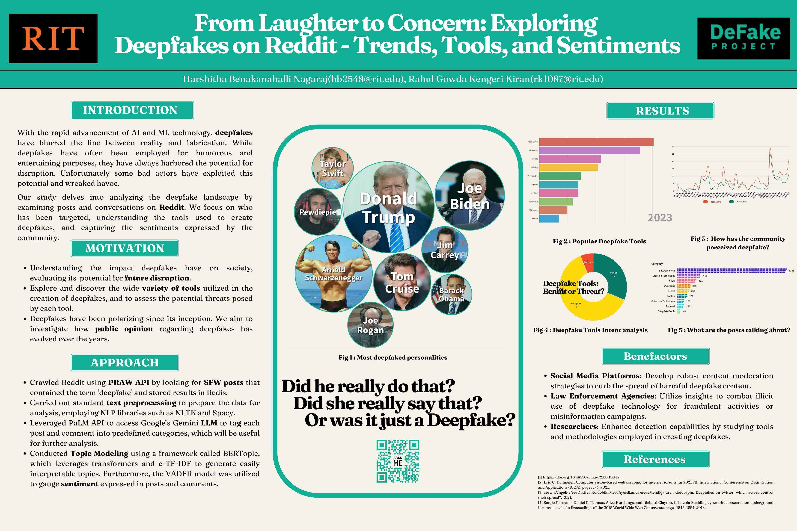

# Project Title : From Laughter to Concern: Exploring Deepiakes on Reddit - Trends, Tools, and Sentiments

### :computer:  **Domain:**  

#### Natural Language Processing

### 📖 **Skills Used:** 

#### Data Crawling, NLP, Data Visualization

### :chart_with_upwards_trend: **Project Overview:** 

With the rapid advancement of Al and ML technology, deepfakes have blurred the line between reality and fabrication. While deepfakes have often been employed for humorous and entertaining purposes, they have always harbored the potential for disruption. Unfortunately some bad actors have exploited this potential and wreaked havoc.
Our study delves into analyzing the deepfake landscape by examining posts and conversations on Reddit. We focus on who has been targeted, understanding the tools used to create deepfakes, and capturing the sentiments expressed by the community.

### 💡 **Motivation:**

• Understanding the impact deepfakes have on society, evaluating its potential for future disruption.
• Explore and discover the wide variety of tools utilized in the creation of deepfakes, and to assess the potential threats posed by each tool.
• Deepfakes have been polarizing since its inception. We aim to investigate how public opinion regarding deepfakes has evolved over the years.

### 📚 Approach:

• Crawled Reddit using PRAW API by looking for SFW posts that contained the term 'deepfake and stored results in Redis.
• Carried out standard text preprocessing to prepare the data for analysis, employing NLP libraries such as NLTK and Spacy.
• Leveraged PaLM API to access Google's Gemini LLM to tag each post and comment into predefined categories, which will be useful for further analysis.
• Conducted Topic Modeling using a framework called BERTopic, which leverages transformers and c-TF-IDF to generate easily interpretable topics. Furthermore, the VADER model was utilized to gauge sentiment expressed in posts and comments.

Poster:

